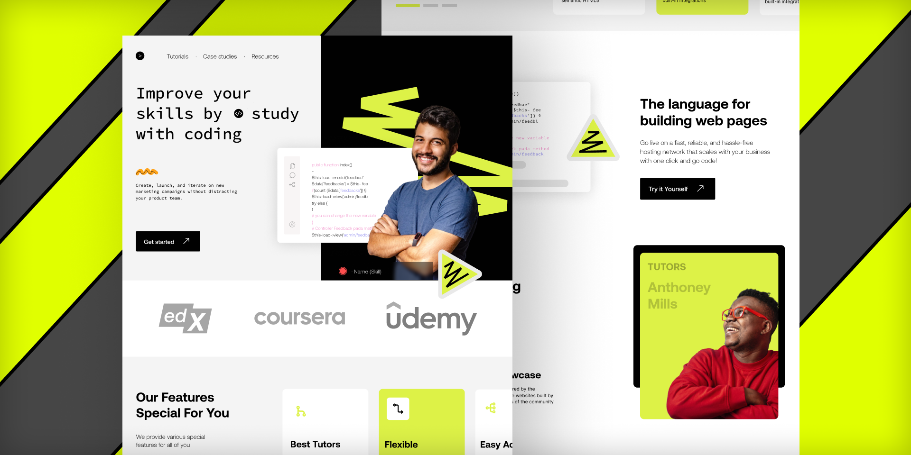

# One page (Grupo Telegram)
Projeto de uma OnePage desenvolvida em equipe por desenvolvedores front-end jr   *layout retirado da comunidadde do figma*
#

### Metodologia Convenção Utilisada BEM 

- **Bloco** : *Etidade autônomaque é significativa por se só.*
#### ex: header, footer

- **Elemento** : *Parte de um bloco (Elemento-filho).*
#### ex: item de menu, item de lista

- **Modificador** : *Uma varaiante de um bloco ou elemento.*
#### ex: disabled, dark, active

## bloco
.menu

## Elemento
.menu__item .menu__link

## Modificador
.menu--dark,  .menu__item--active
#

